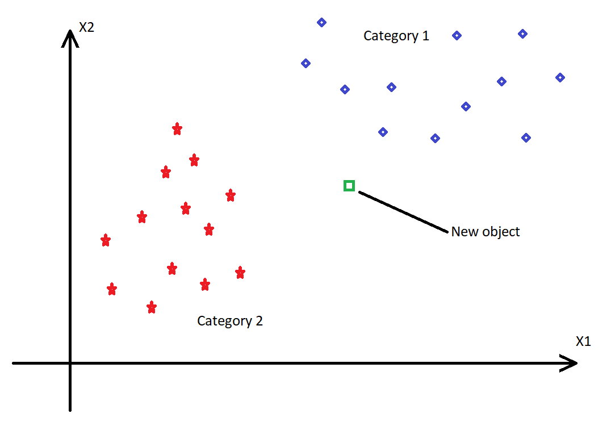
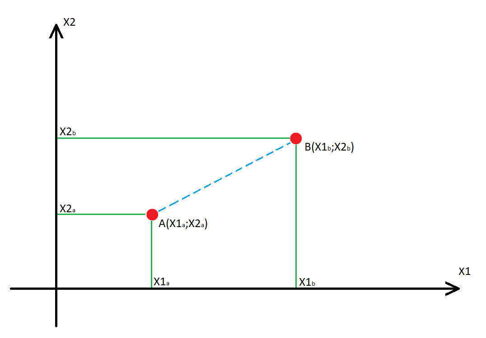
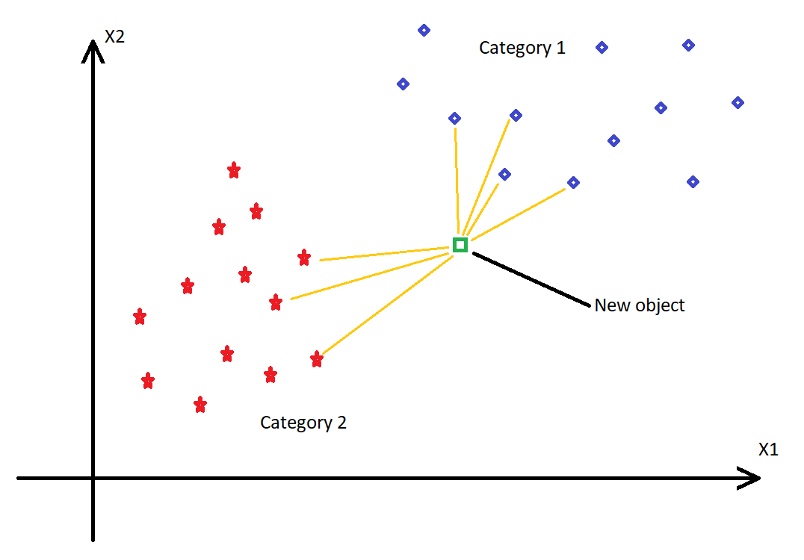

# KNNClassifier

## Introduction
**KNN classifier** is simple *Machine Learning* algorithm.
It belongs to supervised learning techniques.

This Classifier is called *lazy learner algorithm*. It is not because of no reasons. 
There are some examples:
* it looks for similarities between "new data" and cases in training set, then put the new object into best fitting category, basing on 
which category is it most similar to,
* it doesn't learn from training set immediately, but it looks for data at the moment of classification. It means that every new object that has to be classified must be *"compared"* with every class and after that it will be fitted to most similar one,
* **non-parametric algorithm** - means no assumption on base dataset.

## Work process
**KNN classifier** is performed in several steps and can be explained this way:
1. Decide how many **"neighbors"** will be taken into consideration (it will be our **K**),
2. Do some math, calculate the **euclidean distance** of K number of neighbors.
3. Take the K nearest neighbors, where euclidean distance is *"closest"*.
4. Every parameter has to have its "value", it is called **data points**, it has to be counted.
5. **Assign new data points** to category which number of neighbors is highest.

## Example 
### Define K
Lets take 2 categories. We have to classifie one new object as presented below.

First step is to define how many neigbors we will take to consider. In this case K = 7.

### Calculate euclidean distance
Euclidean distance between two points is a square root of sum of squares of differences (however it sounds).
In order to visualise process lets take two example points A and B. Both of them have X1 and X2 parameters.
It can be presented like this:

Blue line shows **distance** between those points. So in order to calculate **euclidean distance** we can use following math expression: 

$\sqrt{(X2b-X2a)^2+(X1b-X1a)^2}$

### Define neighbours and category
Now we can proceed to classification. Calculated distances helps to define which class has more neighbors to new object.
With this knowledge we select K (in our case its 7) neighbors and classifie our new object.

In this example new object is classified as object of Category 1 because it has 4 neighbors from this category and 3 from other.

## Finding best K-value

* There is no such thing as *"best value of K"*. Every data set will require different number, so we have to try some. 
* Large data set can use higher K to make it more effective, but it makes classifier works slower. 
* Too low value of K may underfit classification and return unreliable classifications.
* Try to select value of K that will not cause that every class will have same number of neighbors.

## Pros and Cons
| Advantages | Disadvantages |
| ---------- | ------------- |
| [x] Simple implementation | [x] Need to determine K-value every time |
| [x] Effective on large data sets | [x] K-value must be selected by trying some values |
| [x] Resistance to noisy training data | [x] High cost of computation caused by calculating distances |